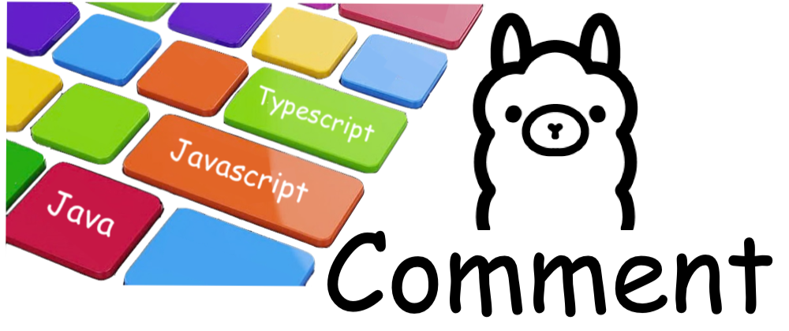

# Welcome to My GitHub Profile!

## Hi there 👋, I'm Eebnezer!

I am a passionate developer with a love for coding and open-source projects. Here's a little bit about me:

## 🔭 Current Projects
- [Project 1](https://github.com/yourusername/project1) - Description of project 1
- [Project 2](https://github.com/yourusername/project2) - Description of project 2

## 🌱 Learning
- Currently exploring: [Technology/Framework/Language]

## 💬 Ask Me About
- [Topic 1]
- [Topic 2]

## 📫 How to Reach Me
- Email: [your.email@example.com](mailto:your.email@example.com)
- LinkedIn: [Your LinkedIn](https://www.linkedin.com/in/yourprofile/)
- Twitter: [@YourTwitterHandle](https://twitter.com/yourhandle)

## 🛠️ Tools & Technologies
- Programming languages: [Language 1], [Language 2]
- Frameworks and libraries: [Framework/Library 1], [Framework/Library 2]
- Tools: [Tool 1], [Tool 2]

## 📈 GitHub Stats

## 🏆 Achievements
- [Achievement 1]
- [Achievement 2]

## 🌐 Personal Website
- Check out my portfolio at [Your Website](https://yourwebsite.com)

## 🤝 Let's Connect!
I love collaborating on open-source projects and connecting with like-minded individuals. Feel free to reach out!

